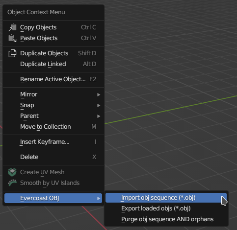

# Blender 3.6
These scripts only support Blender 3.6 LTS at this time.

# OBJ importer/exporter

This plugin provides three very simple operations:  
1) Import an obj sequence from evercoast
2) Export all the **loaded objs** to a folder
3) Purge the objs from blender and remove the orphaned data

The right click context in the 3D viewport will show the options

When loaded the start and end frames match the length of obj sequence, and you'll see the loaded
and currently visible frames on the right hand View Layer pane.

## Import a sequence

Select an obj from a folder. The plugin will detect all the frames, load the current frame (zero indexed) and then setup
a handler that will load other objs on frame change. 

To load the whole sequence click `play` in the timeline, and it'll run through all
the frames and cache them.

## Export a sequence

**Please make a backup of your source files**.

Any objs that have been loaded will be exported. Any non-loaded objs will not be exported.

If you have edited textures you have to save these separately. Blender does provide a `Save all images`
option for this. The obj export will write everything to a new directory, but Blender will overwrite the source 
textures when you click `Save all images`

## Purge objs

When you want to remove all the loaded objs from a scene, click this and it shall delete the mesh and ensure that 
there is no orphaned data left. You can revert this with `ctrl+z` if you click it by accident. 

It also removes the frame change handler so, if you accidentally click this please import the sequence again. 
It won't overwrite existing meshes, but it will setup the frame change handler again to load objs.

